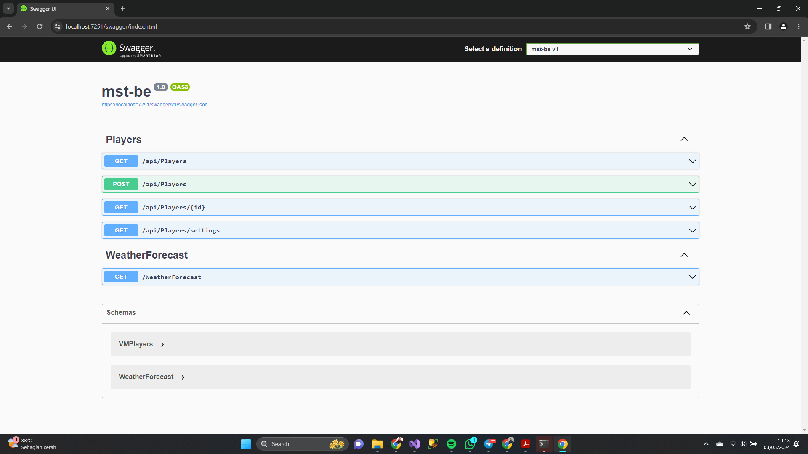

## Menjalankan API WEB 

### 1. Git Clone Repository Ini
Hal pertama yang dapat dilakukan yaitu dengan git clone repository ini.

```https://github.com/elizams1/mst-be-eliza.git ```

### 2. Buka folder pada aplikasi visual studio
Untuk menjalankan web API dapat membuka folder yang sudah dibuat di Visual Studio lalu run projectnya, setelah itu maka akan terlihat web api



